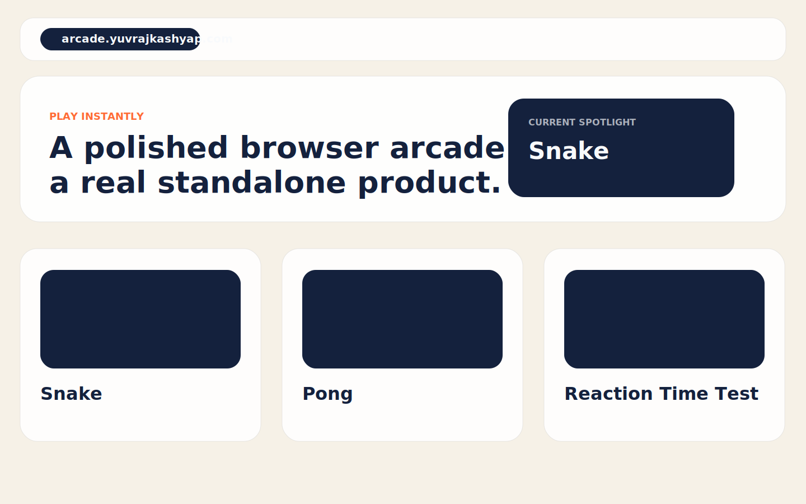
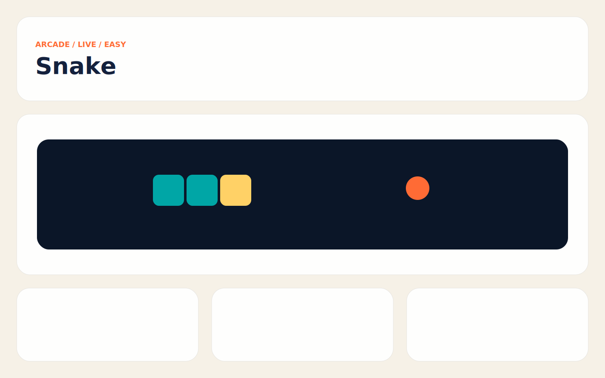

# games.yuvrajkashyap.com

A standalone browser arcade and scalable game library built with Next.js, TypeScript, Tailwind CSS, Framer Motion, and lightweight shared game utilities.




## What this is

`games.yuvrajkashyap.com` is designed as a real product platform, not a demo bucket. It combines:

- a polished homepage with curated discovery
- metadata-rich game detail pages
- modular game registration
- a hybrid rendering model using React for the shell and Canvas or DOM where each game needs it
- a clean path to add more games without building a premature in-house engine

V1 ships with three games:

- `snake`
- `pong`
- `reaction-time`

## Tech stack

- Next.js 16 App Router
- React 19
- TypeScript
- Tailwind CSS v4
- Framer Motion
- Vercel Analytics

## Local setup

```bash
npm install
npm run dev
```

The app runs on `http://localhost:3000`.

## Environment

Copy values from [`.env.example`](./.env.example).

```bash
NEXT_PUBLIC_SITE_URL=https://games.yuvrajkashyap.com
```

## Routes

- `/` homepage with Hero, Featured, New Releases, Categories, and All Games
- `/games/[slug]` metadata-rich game detail and play page
- `/about` platform overview and product posture

## How routing and discovery work

All published games live in [`src/content/games/registry.ts`](./src/content/games/registry.ts). The registry powers:

- homepage sections
- static route generation
- per-game metadata
- related game recommendations

`New Releases` is automatic. Any published game whose `releaseDate` falls within the last 14 days is surfaced there, then drops off without manual cleanup.

## Project structure

```txt
src/
├── app/
├── components/
├── content/
│   └── games/
│       └── registry.ts
├── features/
│   └── games/
│       ├── shared/
│       ├── snake/
│       ├── pong/
│       └── reaction-time/
├── lib/
└── types/
```

## Adding a game

1. Create `src/features/games/<slug>/`.
2. Export the game from `src/features/games/<slug>/index.ts`.
3. Add assets under `public/games/<slug>/`.
4. Register metadata in [`src/content/games/registry.ts`](./src/content/games/registry.ts).
5. Register the lazy runtime import in [`src/features/games/runtime.tsx`](./src/features/games/runtime.tsx).

The route becomes available automatically at `/games/<slug>`.

## Commands

```bash
npm run dev
npm run lint
npm run typecheck
npm run build
```

## Deployment

Deploy on Vercel and point the custom domain to:

```txt
games.yuvrajkashyap.com
```

Set `NEXT_PUBLIC_SITE_URL` in the Vercel project environment to the production origin.

## Documentation

- [Architecture](./docs/architecture.md)
- [Adding a Game](./docs/adding-a-game.md)
- [Design System](./docs/design-system.md)
- [Roadmap](./docs/roadmap.md)

## Current scope

Included:

- platform shell
- homepage discovery sections
- game detail/play pages
- lightweight analytics
- three initial games
- shared game utilities

Intentionally excluded from V1:

- accounts
- auth
- leaderboards
- multiplayer
- backend APIs
- database persistence
- achievements

## Roadmap

Near-term additions after V1 stability:

- sorting and filtering
- richer related games
- local favorites
- per-game changelog blocks
- sound settings

Longer-term direction:

- accounts and cloud profiles
- leaderboards
- achievements
- saves across devices
- multiplayer for selected games
