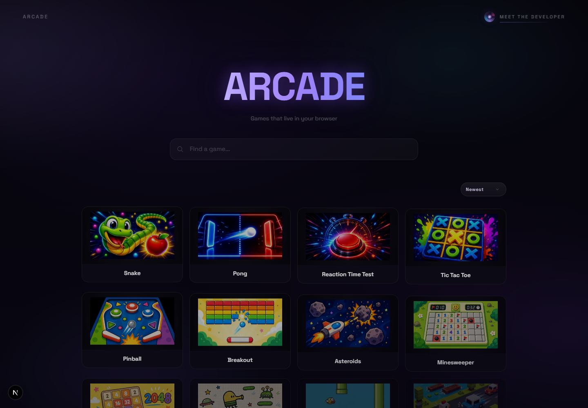
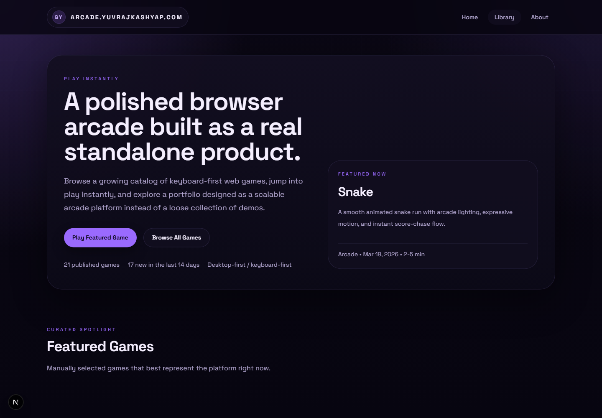
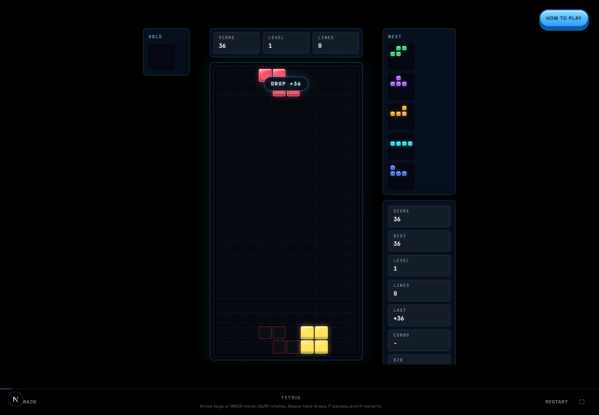
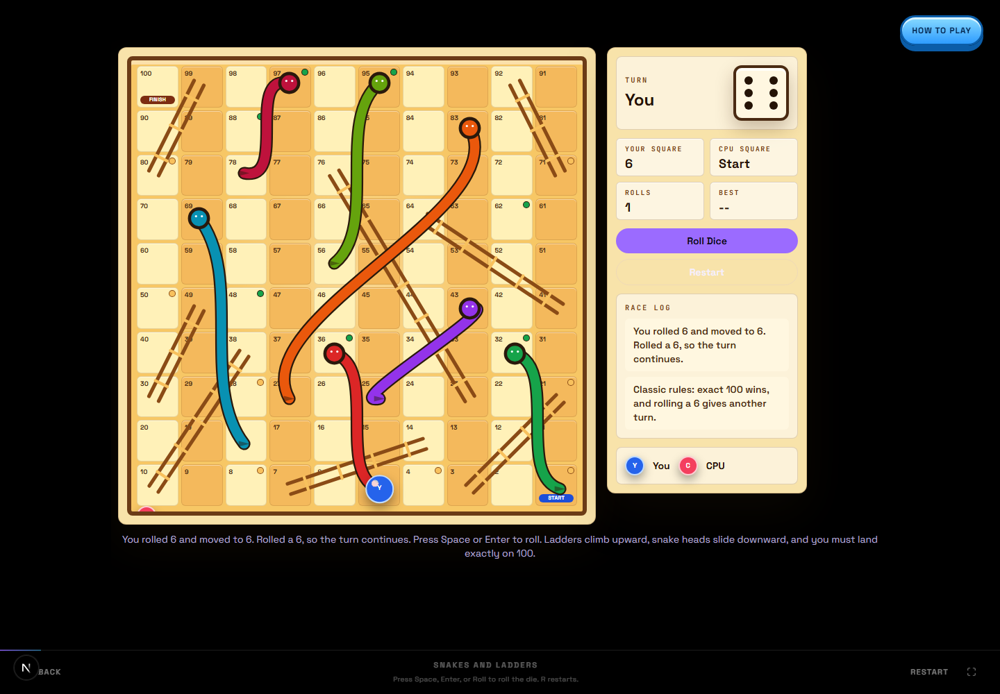
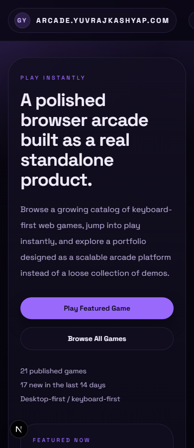

# Arcade



**Arcade** is a polished browser-game platform built as a real standalone product, not a loose folder of demos. It brings a growing catalog of playable web games into one cohesive Next.js application with typed metadata, dynamic game routes, responsive UI, local persistence, SEO-ready metadata, and modular game runtimes.

The goal is simple: make the site feel like a product a user can actually browse, play, revisit, and judge on engineering quality.

## Live Product

Production target:

```txt
https://arcade.yuvrajkashyap.com
```

Local development:

```txt
http://localhost:3000
```

## Why This Project Matters

This repo is designed to demonstrate practical frontend engineering beyond static pages:

- real-time interactive game loops
- Canvas and DOM-based game rendering
- keyboard, mouse, and touch controls
- local best-score persistence
- dynamic routing and metadata generation
- modular feature folders for each game
- typed content registry and derived catalog selectors
- responsive product UI across desktop and mobile
- asset management for thumbnails, app icons, and embedded game builds
- a codebase structure that can keep scaling as the catalog grows

For recruiters and reviewers, this project is meant to show product sense, UI craft, TypeScript discipline, performance awareness, and the ability to turn many small interactive systems into one coherent web application.

## Screenshots

### Game Library



### Tetris



### Snakes and Ladders



### Mobile Library



## Current Scope

Arcade currently ships with a multi-game catalog rather than a single isolated prototype.

| Area | Status |
| --- | --- |
| Platform shell | Live |
| Registry-driven catalog | Live |
| Dynamic game routes | Live |
| Lazy game runtime mounting | Live |
| Local score/best persistence | Live in supported games |
| Responsive desktop/mobile layouts | Live |
| SEO metadata and sitemap support | Live |
| App icons / favicon / Apple icon | Live |
| Backend accounts / cloud saves | Not included in V1 |

## Game Catalog

The catalog includes arcade, puzzle, reaction, board, runner, and platformer experiences:

| Game | Implementation Focus |
| --- | --- |
| Snake | Grid rules with smooth canvas-style arcade presentation and local best score |
| Pong | Paddle physics, collision response, score loop, and AI opponent |
| Reaction Time Test | Timing state machine, fastest-reaction tracking, and simple input paths |
| Tic Tac Toe | CPU difficulties, keyboard focus, and deterministic board logic |
| Pinball | Embedded local Flutter Pinball web build with vendored static assets |
| Breakout | Ball/paddle collision, brick durability, lives, levels, and powerups |
| Asteroids | Momentum movement, shooting, waves, object splitting, and canvas rendering |
| Minesweeper | Protected first reveal, flagging, board sizes, timer, and best times |
| 2048 | Deterministic merge semantics, swipe/keyboard controls, and best score |
| Doodle Jump | Platform generation, vertical camera movement, scoring, and touch steering |
| Flappy Bird | Gravity/flap loop, pipe collision, tap input, and local best |
| Crossy Roads | Lane generation, traffic movement, camera advancement, and hop input |
| Chrome Dino | Runner speed scaling, jump/duck controls, obstacles, and score loop |
| Pac-Man | Maze movement, pellets, power pellets, frightened ghosts, tunnels, and lives |
| Tetris | 7-bag queue, hold, ghost piece, SRS wall kicks, lock delay, line scoring, combos |
| Cookie Clicker | Incremental economy, upgrade scaling, passive production, and saved progress |
| Snakes and Ladders | 100-square board, dice flow, exact finish, snakes, ladders, CPU turn pacing |
| Sorry! | Card/pawn race with start/home spaces, bumps, CPU turns, and original art |
| Street Fighter | Side-view fighting loop, health, timer, attacks, jumps, and CPU pressure |
| Helix Jump | Rotating platform stack, gap detection, danger slices, and score progression |
| Stack | Timing-based block placement, overlap trimming, speed ramp, and best score |

The source of truth for published games is [src/content/games/registry.ts](./src/content/games/registry.ts).

## Technical Highlights

### Product Architecture

Arcade is organized as a product platform with individually mounted game runtimes:

- `src/app/` owns Next.js routes, layouts, metadata routes, and file-based app icons.
- `src/content/games/registry.ts` owns typed game metadata.
- `src/lib/games/catalog.ts` derives featured games, new releases, related games, and published slugs.
- `src/features/games/runtime.tsx` maps game slugs to lazy-loaded game components.
- `src/components/games/game-player.tsx` mounts the selected runtime behind a runtime boundary.
- `src/features/games/shared/` contains shared game UI, animation-loop hooks, and local-storage helpers.

This keeps the catalog layer separate from gameplay logic, so adding games does not require rewriting route code or homepage logic.

### Runtime Patterns

The games intentionally use different implementation styles:

- Canvas-style continuous loops for action games.
- DOM grids for precise board/puzzle interactions.
- Embedded static web assets for Pinball.
- Reducer-like state transitions for deterministic puzzle rules.
- Browser-only client components for keyboard, pointer, touch, animation, and storage APIs.

That variety is deliberate: it demonstrates that the platform can host multiple interaction models without turning into a framework-specific tangle.

### Metadata and Discovery

Each catalog entry includes:

- slug
- title
- descriptions
- thumbnail
- genre
- tags
- controls
- difficulty
- session length
- release date
- publish status
- supported inputs
- mobile support notes
- related games

Those fields power the homepage, library page, detail pages, Open Graph data, and game runtime selection.

### Browser-First UX

The experience is optimized around quick play:

- instant game loading
- keyboard-first controls for desktop
- touch controls where mobile makes sense
- persistent best scores through local storage
- clear status copy per game
- restart and pause flows
- honest mobile-support metadata

## Tech Stack

| Layer | Tools |
| --- | --- |
| Framework | Next.js 16 App Router |
| UI Runtime | React 19 |
| Language | TypeScript |
| Styling | Tailwind CSS v4 |
| Motion | Framer Motion and CSS transitions |
| Analytics | Vercel Analytics |
| Deployment Target | Vercel |

## Local Development

### Requirements

- Node.js `>=20.9.0`
- npm `11.6.2` or compatible

The pinned Node version is in [.nvmrc](./.nvmrc).

### Install

```bash
npm install
```

### Run

```bash
npm run dev
```

Open:

```txt
http://localhost:3000
```

### Verify

```bash
npm run lint
npm run typecheck
npm run build
```

Or run the full check:

```bash
npm run check
```

## Environment

V1 uses a minimal environment surface:

```bash
NEXT_PUBLIC_SITE_URL=https://arcade.yuvrajkashyap.com
```

This is used for canonical metadata, sitemap URLs, and Open Graph URLs.

See [.env.example](./.env.example).

## Folder Structure

```txt
src/
  app/
    layout.tsx              Root app layout and metadata
    games/[slug]/page.tsx   Dynamic game page route
    icon.*                  App icons and favicon assets
  components/
    games/                  Game page shell, player, runtime boundary
    homepage/               Homepage sections
    layout/                 Header, footer, site shell
  content/games/
    registry.ts             Typed game catalog source of truth
  features/games/
    runtime.tsx             Lazy game runtime map
    shared/                 Shared game UI, hooks, and storage helpers
    snake/
    pong/
    tetris/
    pacman/
    ...
  lib/
    constants/              Site constants
    games/                  Catalog selectors
    utils/                  Small shared helpers
  types/
    game.ts                 Shared game metadata types
public/
  brand/                    README images and brand assets
  games/                    Game thumbnails
  vendor/                   Vendored static game assets
docs/                       Architecture, design, roadmap, contribution docs
```

## Adding a New Game

1. Create a new feature folder:

```txt
src/features/games/<slug>/
```

2. Export the game runtime from:

```txt
src/features/games/<slug>/index.ts
```

3. Add thumbnail and static assets under:

```txt
public/games/<slug>/
```

4. Add a typed metadata entry in:

```txt
src/content/games/registry.ts
```

5. Add the lazy runtime import in:

```txt
src/features/games/runtime.tsx
```

6. Run:

```bash
npm run check
```

Full guide: [docs/adding-a-game.md](./docs/adding-a-game.md)

## Design Direction

Arcade uses a dark, premium arcade shell with game-specific experiences inside each runtime. The platform UI stays restrained so the games can carry their own visual identity.

Current design priorities:

- strong first impression
- high-contrast game thumbnails
- dense but readable library browsing
- clear game metadata
- responsive layouts that do not collapse awkwardly
- game surfaces that feel purpose-built, not generic cards

Design notes: [docs/design-system.md](./docs/design-system.md)

## Engineering Decisions

### Why a Registry?

A typed registry gives every game one predictable metadata contract. This avoids scattering titles, thumbnails, controls, route status, and related-game data across components.

### Why Lazy Game Runtimes?

Game components can be heavy. Lazy runtime mapping keeps discovery and metadata lightweight while loading each playable game only when needed.

### Why No Backend Yet?

The current product goal is a fast, public, browser-first arcade. Auth, leaderboards, cloud saves, achievements, and multiplayer would be meaningful later, but they are not required for V1. Local persistence gives enough continuity without adding unnecessary infrastructure.

### Why Multiple Rendering Styles?

Different games need different interaction models. A maze chase, a timing game, a board game, and a falling-block puzzle should not all be forced through one homemade engine. The repo favors the right implementation style per game while keeping platform integration consistent.

## Roadmap

Near-term:

- sound settings and per-game audio polish
- better mobile support on desktop-first games
- richer game detail pages
- improved game thumbnails and capture pipeline
- changelog/release notes per game

Later:

- user accounts
- cloud saves
- leaderboards
- achievements
- multiplayer for selected games
- analytics-informed catalog ordering

Detailed roadmap: [docs/roadmap.md](./docs/roadmap.md)

## Reviewer Notes

When reviewing the repo, start here:

- [src/content/games/registry.ts](./src/content/games/registry.ts) for the product catalog model
- [src/features/games/runtime.tsx](./src/features/games/runtime.tsx) for lazy runtime mounting
- [src/components/games/game-player.tsx](./src/components/games/game-player.tsx) for runtime isolation
- [src/features/games/tetris/components/block-drop-game.tsx](./src/features/games/tetris/components/block-drop-game.tsx) for a more advanced puzzle runtime
- [src/features/games/pacman/components/pac-maze-game.tsx](./src/features/games/pacman/components/pac-maze-game.tsx) for a maze/chase runtime
- [src/features/games/snakes-and-ladders/components/ladder-race-game.tsx](./src/features/games/snakes-and-ladders/components/ladder-race-game.tsx) for board-game state and animated movement

## Documentation

- [Architecture](./docs/architecture.md)
- [Adding a Game](./docs/adding-a-game.md)
- [Design System](./docs/design-system.md)
- [Roadmap](./docs/roadmap.md)
- [Contributing](./CONTRIBUTING.md)

## License

No open-source license has been selected yet. Until that changes, treat the repository as all rights reserved.
