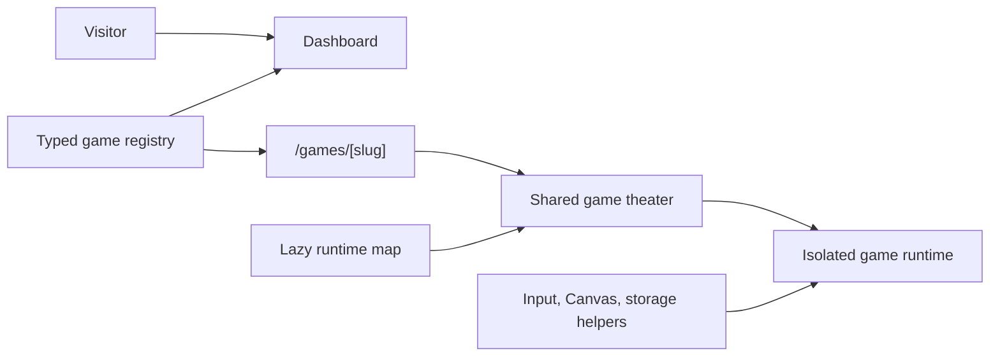

# Architecture

Arcade is a single Next.js App Router product with a stable platform shell and 30 independently implemented game runtimes. The architecture keeps discovery, metadata, routing, and shared browser mechanics centralized while leaving each game's rules, state machine, rendering, and feel inside its own feature module.

## System flow

## Primary layers

| Layer | Responsibility | Primary paths |
| --- | --- | --- |
| Product shell | Navigation, metadata, discovery, analytics, responsive layout | `src/app`, `src/components/layout`, `src/components/homepage` |
| Catalog model | Typed metadata, homepage collections, related games, static slugs | `src/content/games/registry.ts`, `src/lib/games/catalog.ts`, `src/types/game.ts` |
| Game theater | Runtime mounting, keyboard capture, controls, help, restart, fullscreen | `src/components/games` |
| Runtime map | Lazy association between slugs and client-only modules | `src/features/games/runtime.tsx` |
| Game modules | Per-game rules, state, rendering, controls, and persistence | `src/features/games/<slug>` |
| Shared mechanics | Animation loop, input, HiDPI Canvas, math, and local storage | `src/features/games/shared` |

## Route model

Public routes:

- `/` — catalog dashboard
- `/library` — navigation-visible catalog and discovery view
- `/about` — product and authorship context
- `/games/[slug]` — one generic statically generated route model for all 30 games

Framework surfaces also include route-level loading, error, not-found, robots, sitemap, icons, canonical metadata, and Open Graph metadata.

The repository also retains `/design`, `/play-design`, and `/concept` explorations used during interface development. These routes are intentionally omitted from the sitemap, marked `noindex`, and excluded from recruiter-facing route counts.

The dynamic game page stays generic. The registry provides the content model, catalog selectors validate and derive page data, and the runtime map loads the corresponding client component only when a visitor opens that game.

## Registry-driven product model

[`src/content/games/registry.ts`](../src/content/games/registry.ts) is the source of truth for:

- slug and title
- descriptions and developer notes
- genre, tags, difficulty, and session length
- controls and How to Play content
- release status and version
- supported input methods
- mobile-support classification
- featured and related-game relationships
- thumbnail and route metadata

[`src/lib/games/catalog.ts`](../src/lib/games/catalog.ts) derives dashboard sections, featured games, categories, related games, and static paths without duplicating catalog rules across routes.

Runtime components are intentionally excluded from the registry. That prevents the dashboard and metadata layer from importing every game bundle.

## Runtime isolation

The mounting sequence is:

1. Next.js resolves and statically generates the slug.
2. Catalog selectors return validated game metadata.
3. the shared game page renders product information and controls
4. `GamePlayer` selects the matching lazy runtime
5. `GameRuntimeBoundary` isolates game-specific failures
6. the runtime owns its rules, animation, rendering, and state

One broken game should not destabilize the catalog or unrelated game pages.

## Interaction models

The catalog intentionally exercises several browser application models:

- **16 Canvas-tagged games** use continuous drawing, collision, physics, particles, or camera movement.
- DOM/grid games model boards, cards, word input, incremental state, and timing without forcing Canvas where it does not help.
- Rules-heavy games use deterministic state transitions, legal-move generation, CPU heuristics, or minimax.
- All 30 entries expose keyboard and touch support metadata.
- 24 games are classified as full mobile support, four as partial, and two as desktop-best.
- Flutter Pinball is a vendored third-party static web build mounted through an isolated local embed and clearly attributed.

Shared browser-level utilities stay intentionally small. Arcade is not presented as a custom game engine; repeated browser mechanics are shared while gameplay stays local.

## Input and viewport behavior

The shared theater captures gameplay keys so arrows, WASD, Space, and similar controls do not scroll the document while a game is active. It also centralizes:

- restart and fullscreen affordances
- How to Play content
- keyboard-focus behavior
- viewport-fit constraints
- game runtime error handling
- responsive product framing

Individual runtimes add touch controls when phone play needs a different interaction model.

## Persistence

V1 uses browser-local persistence where useful for:

- high scores
- best times
- progress
- records
- selected settings
- game-specific unlocks

There is intentionally no account system, database, cloud save, leaderboard, or multiplayer backend. The README and UI distinguish shipped local capabilities from future platform work.

## Third-party boundary

The open-source Flutter Pinball integration is not claimed as original work.

- Attribution: [`public/vendor/flutter-pinball/ATTRIBUTION.txt`](../public/vendor/flutter-pinball/ATTRIBUTION.txt)
- Preserved upstream license: [`public/vendor/flutter-pinball/LICENSE.original.txt`](../public/vendor/flutter-pinball/LICENSE.original.txt)

The remaining published runtimes are self-coded implementations with original rendered presentation built around familiar gameplay patterns.

## Quality and presentation automation

- `npm run check` runs lint, typecheck, and a production build.
- [`.github/workflows/ci.yml`](../.github/workflows/ci.yml) runs that gate on pushes and pull requests.
- [`scripts/capture-recruiter-showcase.mjs`](../scripts/capture-recruiter-showcase.mjs) captures every recruiter-facing route from a production build of the current branch at desktop and mobile sizes.
- [`docs/recruiter-showcase.md`](recruiter-showcase.md) catalogs the resulting product evidence.

## Best review path

1. [Typed catalog](../src/content/games/registry.ts)
2. [Derived catalog selectors](../src/lib/games/catalog.ts)
3. [Lazy runtime map](../src/features/games/runtime.tsx)
4. [Shared game page and theater](../src/components/games/game-page-view.tsx)
5. [Tetris runtime](../src/features/games/tetris/components/block-drop-game.tsx)
6. [Pac-Man runtime](../src/features/games/pacman/components/pac-maze-game.tsx)
7. [Sorry! rules runtime](../src/features/games/sorry/components/sorry-sprint-game.tsx)
8. [Shared browser utilities](../src/features/games/shared)
